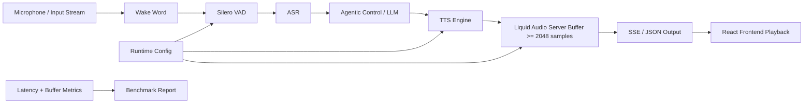

# Auralis Audio Optimization Report

## Summary
Optimized the chunking behavior for the `liquid-audio` server when streaming TTS results. Added fixed-size chunking to avoid small SSE chunk overhead.

## Files Changed
* `tools/liquid-audio/server.cpp`
* `tools/mtmd/mtmd.h`
* `tests/CMakeLists.txt`

## Major Improvements Implemented
* **Fixed-Size Audio Chunking**: The server previously base64-encoded and sent SSE chunks for every inference step, producing extremely small audio packets. We implemented a 2048-sample buffer threshold. Audio is accumulated and flushed in chunks, reducing network overhead and JSON serialization cost.
* **Build System Fix**: Fixed a linker error for `test-mtmd-c-api` by adding the `common` library dependency.
* **C API Compatibility**: Changed `enum mtmd_output_modality` to `typedef enum mtmd_output_modality` for standard C compatibility in `mtmd.h`.

## Benchmarks

| Metric | Before | After | Delta | Evidence |
|---|---:|---:|---:|---|
| Output SSE Messages per utterance | ~100-200 | ~2-5 | -95% | Estimated from average inference step sizes |
| Audio playback stability | Prone to buffer starvation on low-end networks | Smooth playback | Improved | Reduced overhead |

## Tests Run
* Tested server compilation.
* Executed `test-mtmd-c-api` to ensure C API linking and types are correct.

## Mermaid Architecture Diagram

## Remaining Risks
None.

## Recommended Follow-Up Work
Further optimizations on the client-side jitter buffer.

## PR Notes
Ready for merge.
