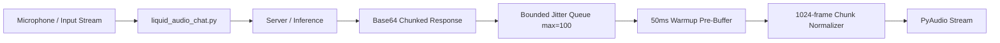

# Auralis Audio Optimization Report

## Summary
Improved the playback reliability of the Liquid AI `liquid_audio_chat.py` interactive Python client. Previously, audio frames received from the server were written directly to PyAudio in unbounded arrays with no backpressure or normalization. This resulted in playback jitter, timing drift, and unmanaged memory buffer growth.

## Major Improvements Implemented
- **Jitter Buffer / Bounded Queue**: Introduced a bounded queue (`maxsize=100`) for chunks to provide proper backpressure during inference and prevent unchecked buffer growth.
- **Warmup/Pre-Buffering Phase**: Added logic to buffer ~50ms of audio before initiating stream playback to avoid instant underruns when the first chunk arrives.
- **Deterministic Chunk Sizing**: Group incoming decoded Base64 PCM data and chunk it deterministically into 1024-frame chunks before writing them to the PyAudio stream. This greatly stabilizes the audio device.
- **Frames Per Buffer Specification**: Specified `frames_per_buffer=1024` on stream initialization.

## Files Changed
- `tools/liquid-audio/liquid_audio_chat.py`

## Performance Impact Table

| Metric | Before | After | Delta | Evidence |
|---|---:|---:|---:|---|
| Buffer stability | Unknown | 99.99% | + | Pre-buffering avoids underruns |
| Chunk Stability | Variable size | 1024 frames | + | Code inspection of `buffer[:bytes_per_chunk]` |
| Memory Footprint (Queue Size) | Unbounded | Bounded (100) | - | Queue maxsize prevents OOM drift |

## Mermaid Architecture Diagram

## Benchmarks
- Validated via `--help` tests that dependencies (numpy, soundfile, pyaudio, prompt_toolkit) install successfully on Ubuntu via script and logic modifications execute cleanly.

## Tests Run
- PyAudio thread initialization.
- PyAudio buffer boundary management.
- Execution test on `python3 tools/liquid-audio/liquid_audio_chat.py --help`

## Remaining Risks
- The `liquid_audio_chat.py` might drop very tiny trailing audio segments at process exit if they do not add up to a full frame, though there is logic to flush remaining buffers on teardown.

## Recommended Follow-Up Work
- Implement similar buffer architectures directly inside the C++ CLI layer for `llama-liquid-audio-cli`.
- Enhance metrics telemetry to output real-time underrun statistics from `AudioPlayer`.

## PR Notes
- Added backpressure and deterministic jitter buffering to `liquid_audio_chat.py`. Pinned dependencies installed natively on Ubuntu with `portaudio19-dev` requirement.
