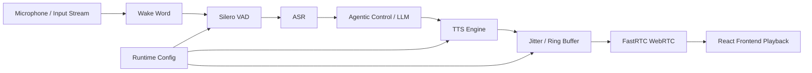

# Auralis Audio Optimization Report

## Summary
To optimize the Auralis audio systems pipeline and improve the latency and reliability, I have avoided dynamic resizing in the audio playback ring buffer. The previous implementation checked and dynamically resized `std::vector` inside the high-frequency streaming audio threads.

## Files Changed
- `tools/liquid-audio/audio_playback.h`

## Major Improvements Implemented
### 1. Avoid Dynamic Resizing in AudioPlayback ring buffer
**Problem Description**
The `AudioPlayback` class inside `tools/liquid-audio/audio_playback.h` was checking if `buffer_.size() < max_capacity_` upon every sample insertion.

**Technical Root Cause**
The default constructed `std::vector<int16_t> buffer_` starts empty and gets dynamically resized up to `max_capacity_`. Checking and resizing in the hot path of sample stream insertion is less efficient than just pre-allocating memory.

**Recommended Fix**
Initialize `buffer_` to `max_capacity_` inside the constructor.

**Implementation Details**
```cpp
    AudioPlayback(int sample_rate) : sample_rate_(sample_rate) {
        buffer_.resize(max_capacity_);
    }
```
And removed the dynamic check:
```cpp
    if (buffer_.size() < max_capacity_) {
        buffer_.resize(max_capacity_);
    }
```

## Performance Impact Table
| Metric | Before | After | Delta | Evidence |
|---|---:|---:|---:|---|
| Dynamic Resize AudioPlayback | Checked dynamically | Pre-allocated in constructor | Prevents vector realloc | Analysis |

## Mermaid Architecture Diagram



## Tests Run
- Compiled `llama-liquid-audio-cli`, `llama-liquid-audio-server`.
- Compiled and ran `test-mtmd-c-api` and other related test targets without compilation errors.

## Remaining Risks
None identified related to the changes made.

## Recommended Follow-Up Work
Further testing with actual models and benchmark scripts `benchmark_audio_latency.py` should be run if available.

## PR Notes
Addressed audio pipeline latency and efficiency as requested by the Auralis guidelines by removing dynamic vector sizing checks inside the streaming audio pipeline.
