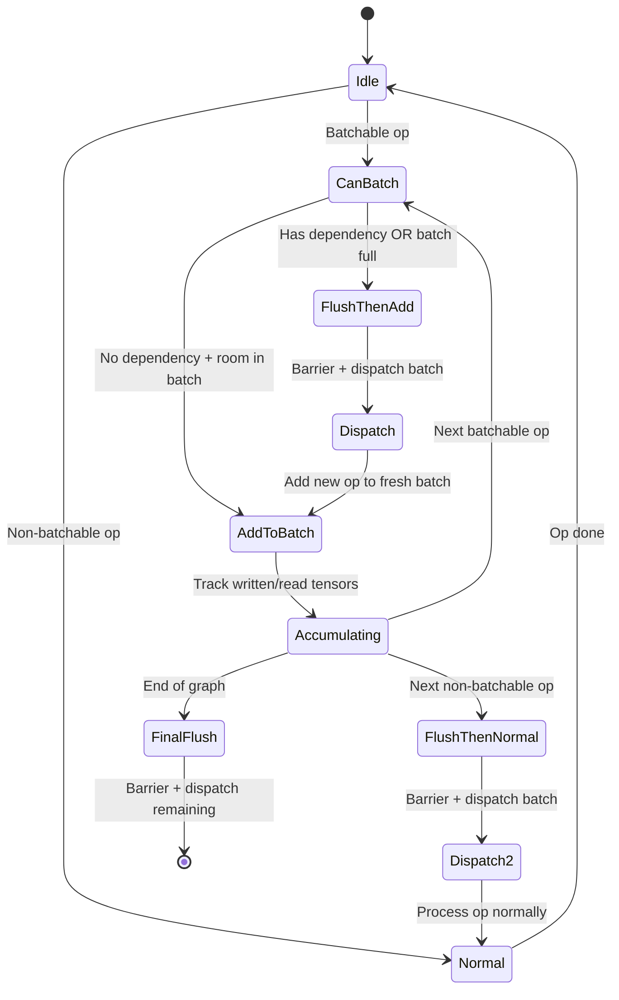
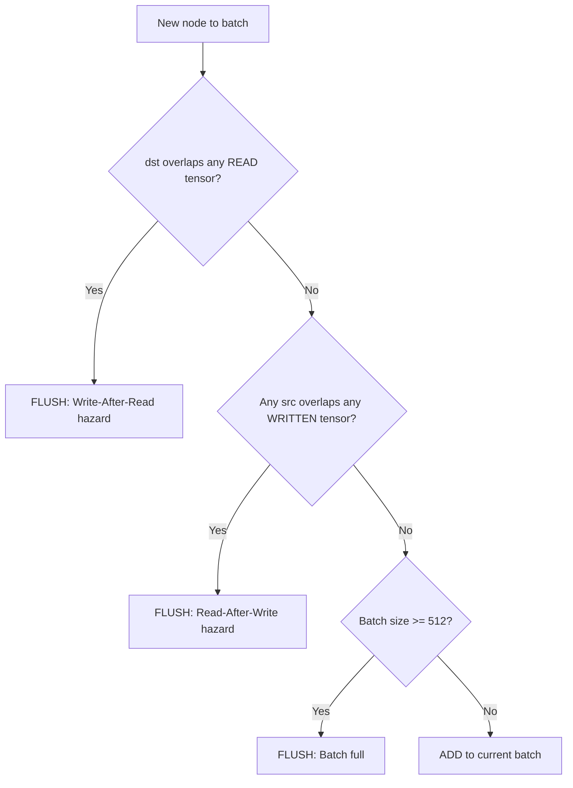
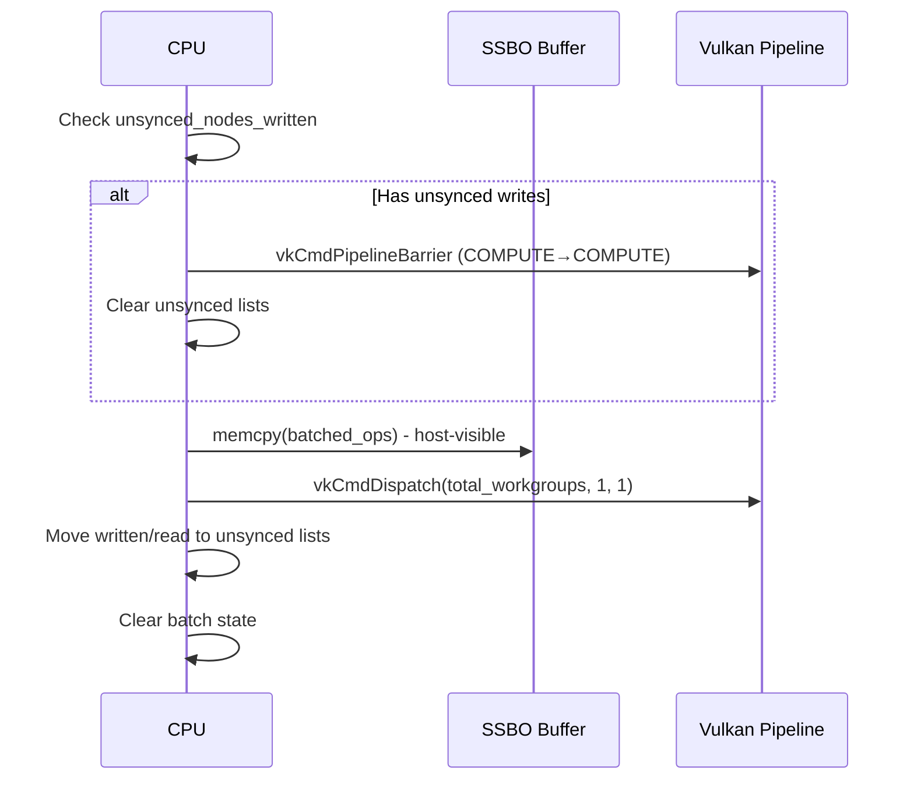

# Batched Elementwise Mega-Kernel Specification

## State Machine Diagram



## Dependency Check Flow



## Flush Sequence



## Gherkin Verification Spec

```gherkin
Feature: Batched Elementwise Mega-Kernel
  The Vulkan backend batches small elementwise GPU operations into a single
  mega-kernel dispatch to reduce per-op overhead (~5-8us per dispatch saved).

  Background:
    Given the GPU supports VK_EXT_buffer_device_address
    And the GPU supports shaderInt64
    And the batched_elementwise_f32 pipeline is initialized
    And the SSBO buffer is allocated and host-visible

  # ─── Op eligibility ───

  Scenario Outline: Supported unary ops are batchable
    Given a contiguous f32 tensor of shape [128, 1, 1, 1]
    When a <op> operation is evaluated
    Then it should be batched into the mega-kernel

    Examples:
      | op       |
      | SILU     |
      | EXP      |
      | SOFTPLUS |
      | RELU     |
      | NEG      |
      | TANH     |
      | SIGMOID  |

  Scenario: SIGMOID is NOT batched when part of topk_moe fusion
    Given a SIGMOID op followed by the topk_moe fusion pattern
    When the SIGMOID is evaluated for batching
    Then it should NOT be batched
    And the topk_moe fusion path should handle it instead

  Scenario: Same-shape binary MUL is batchable
    Given two contiguous f32 tensors of shape [128, 4, 1, 1]
    When a MUL operation between them is evaluated
    Then it should be batched into the mega-kernel

  Scenario: Same-shape binary SUB is batchable
    Given two contiguous f32 tensors of shape [128, 4, 1, 1]
    When a SUB operation between them is evaluated
    Then it should be batched into the mega-kernel

  Scenario: Broadcast binary MUL is NOT batchable
    Given src0 of shape [128, 4, 1, 1] and src1 of shape [128, 1, 1, 1]
    When a MUL operation between them is evaluated
    Then it should NOT be batched
    Because the mega-kernel uses flat 1D modulo, not per-dimension fastmod

  Scenario: ADD is NOT batched (performance regression)
    Given a contiguous f32 ADD operation
    When the ADD is evaluated for batching
    Then it should NOT be batched
    Because dependency flush overhead outweighs dispatch savings (+1500us)

  Scenario: SCALE without bias is batchable
    Given a SCALE op with scale=2.0 and bias=0.0
    When the SCALE is evaluated for batching
    Then it should be batched with param0=2.0

  Scenario: SCALE with non-zero bias is NOT batchable
    Given a SCALE op with scale=2.0 and bias=1.0
    When the SCALE is evaluated for batching
    Then it should NOT be batched
    Because the mega-kernel ignores the bias parameter

  Scenario: Non-contiguous tensor is NOT batchable
    Given a non-contiguous f32 tensor (e.g., a transposed view)
    When any elementwise operation on it is evaluated
    Then it should NOT be batched

  Scenario: Non-f32 tensor is NOT batchable
    Given a tensor of type f16 or q4_0
    When any elementwise operation on it is evaluated
    Then it should NOT be batched

  # ─── Dependency tracking ───

  Scenario: Independent ops accumulate into one batch
    Given 10 independent SILU ops on different tensors
    When the graph is processed
    Then all 10 ops should be in a single batch
    And only 1 GPU dispatch should occur

  Scenario: Chained ops flush between each (Read-After-Write)
    Given a chain: out = mul(mul(mul(a, b0), b1), b2)
    When the graph is processed
    Then each MUL should trigger a flush before the next
    Because each op reads the previous op's output (RAW hazard)
    And 3 separate GPU dispatches should occur

  Scenario: Write-After-Read hazard triggers flush
    Given op1 reads tensor X, and op2 writes to tensor X
    When op2 is added to the batch containing op1
    Then the batch should flush before adding op2
    Because op2's dst overlaps op1's src (WAR hazard)

  Scenario: Batch full triggers flush
    Given 512 ops already accumulated in the batch
    When a 513th batchable op is encountered
    Then the current batch of 512 should flush first
    And the new op starts a fresh batch

  # ─── Barrier correctness ───

  Scenario: First batch dispatch has no preceding barrier
    Given no prior unsynced writes exist
    When the first batch is flushed
    Then no pipeline barrier is inserted before the dispatch
    Because there is nothing to synchronize against

  Scenario: Subsequent batch dispatch inserts barrier
    Given a previous batch was flushed (unsynced writes exist)
    When the next batch is flushed
    Then a COMPUTE-to-COMPUTE pipeline barrier is inserted
    Before the new dispatch executes

  Scenario: Non-batchable op after batch triggers flush
    Given 5 ops accumulated in the batch
    When a non-batchable op (e.g., RMS_NORM) is encountered
    Then the batch of 5 should flush first
    And the RMS_NORM processes via the normal dispatch path

  # ─── End-to-end correctness ───

  Scenario: nf=16 chained MUL produces correct results
    Given 16 chained MUL ops: out = mul(mul(...mul(a, b0)..., b14), b15)
    And all tensors are f32 shape [16, 5, 4, 3]
    When the graph runs on Vulkan backend
    Then the result matches the CPU reference backend
    And the maximum element error is < 1e-7

  Scenario: nf=16 chained SUB produces correct results
    Given 16 chained SUB ops: out = sub(sub(...sub(a, b0)..., b14), b15)
    And all tensors are f32 shape [16, 5, 4, 3]
    When the graph runs on Vulkan backend
    Then the result matches the CPU reference backend

  Scenario: Mixed batchable and non-batchable ops
    Given a graph with: SILU, MUL_MAT, EXP, ADD, SCALE(bias=0), RMS_NORM, NEG
    When the graph is processed
    Then SILU is batched (batch 1)
    And MUL_MAT flushes batch 1, runs normally
    And EXP starts batch 2
    And ADD is NOT batched, flushes batch 2, runs normally
    And SCALE starts batch 3
    And RMS_NORM flushes batch 3, runs normally
    And NEG starts batch 4, flushed at end of graph
```

## Test Results (verified 2026-03-07)

| Test | Count | Status |
|------|-------|--------|
| MUL (all shapes, nr, nf) | ~50 | PASS |
| SUB (all shapes, nr, nf) | ~50 | PASS |
| SCALE (with/without bias) | 4 | PASS |
| SILU | ~20 | PASS |
| EXP | ~20 | PASS |
| SIGMOID | ~20 | PASS |
| SOFTPLUS | ~10 | PASS |
| RELU | ~10 | PASS |
| NEG | ~10 | PASS |
| TANH | ~10 | PASS |
| **Total** | **214** | **ALL PASS** |

## Key Design Decisions

1. **ADD excluded**: Batching ADD saves ~91 dispatches but adds ~1500us barrier overhead (net negative)
2. **No broadcast for binary ops**: Mega-kernel uses flat `idx % src1_n_elements`, can't handle multi-dim broadcast
3. **SIGMOID excluded from batch when starting topk_moe**: Existing fusion is more efficient
4. **Host-visible SSBO**: Required for direct memcpy of op descriptors (no staging buffer needed on UMA)
5. **Single shader with switch**: All op types in one shader avoids pipeline switching overhead
