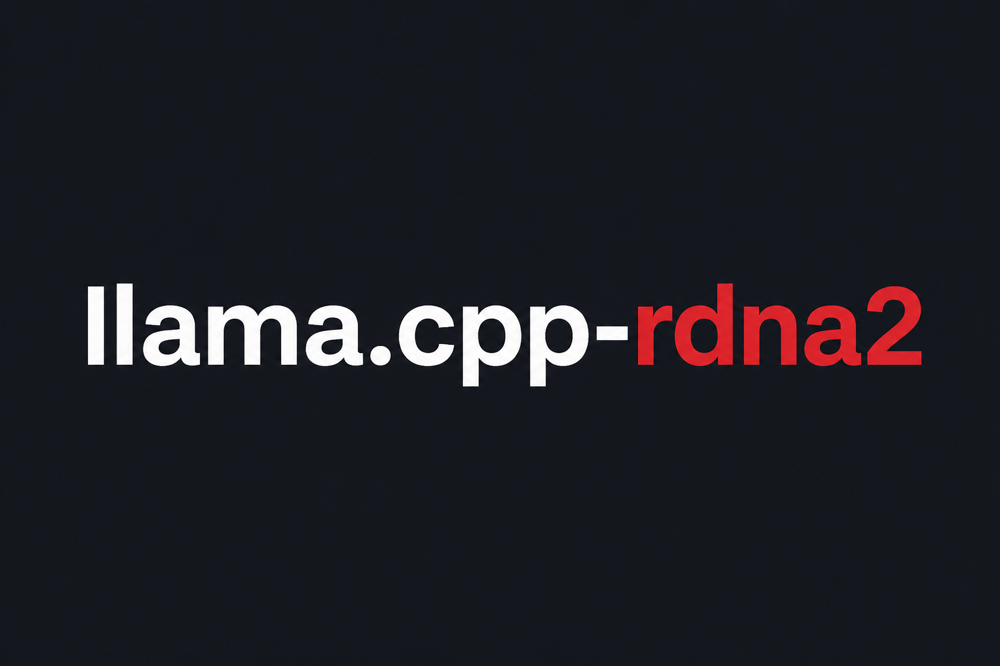

<p align="center">
  
</p>

# llama.cpp RDNA2 / V620 user guide

This branch (`perf/v620-native-mtp-auto-dflash2`, PR #16) contains the tested
HIP/RCCL paths for AMD RDNA2 `gfx1030`, especially four Radeon Pro V620 GPUs.
The native profile is automatic at runtime: users should not need to copy a
large list of feature variables.

Unsupported models, shapes, quantizations, and topologies keep the normal
llama.cpp fallback.

## Quick start

### 1. Requirements

- Linux, CMake, and a ROCm installation with HIP clang and RCCL.
- For the validated path: four V620/`gfx1030` GPUs with tensor splitting.
- A compatible main GGUF; an optional DFlash/MTP draft GGUF may be supplied.

### 2. Build

Use the portable user build helper. It discovers ROCm, clang, RCCL, and the GPU
architecture where possible:

```bash
./scripts/build-rdna2-portable.sh
```

If discovery is ambiguous, provide values without editing the script:

```bash
ROCM_PATH=/path/to/rocm \
TARGET_ARCH=gfx1030 \
BUILD_DIR=build \
./scripts/build-rdna2-portable.sh
```

The helper enables HIP, RCCL, HIP graphs, the RDNA2 no-VMM path, shared/dynamic
backends, CPU variants, the server, examples, and tools. It builds Release
with tests disabled. `GGML_BACKEND_DL=ON` requires shared libraries; the helper
sets both explicitly.

For the native RDNA3/gfx11 build on this unified branch, use the matching
portable helper instead:

```bash
./scripts/build-rdna3-portable.sh
```

It discovers ROCm/clang and the gfx11 target, defaults RCCL and the optional
sidecar targets on, keeps UI assets disabled, and rejects
`HSA_OVERRIDE_GFX_VERSION` for native RDNA3. Set `TARGET_ARCH=gfx1100` or
`ROCM_PATH=/path/to/rocm` when discovery is ambiguous.

The existing `scripts/build-rdna2-rocm.sh` remains the maintainer-oriented
V620/ROCm-7.14 helper. The RDNA2 portable helper remains the corresponding
user entry point for gfx1030.

### 3. Launch

`HSA_OVERRIDE_GFX_VERSION=10.3.0` is required for the tested V620/`gfx1030`
native profile. Do not force it on another GPU architecture. Use these
recommended runtime environments:

**TP2 and higher** (the example uses four GPUs):

```bash
HSA_OVERRIDE_GFX_VERSION=10.3.0 \
HSA_NO_SCRATCH_RECLAIM=1 \
GGML_HIP_RDNA2_AUTO=1 \
GGML_HIP_SAFE_STATE_IO=1 \
GGML_TP_SHARDED_OUTPUT=1 \
./build/bin/llama-server \
  -m /path/to/main.gguf \
  -ngl all \
  --split-mode tensor \
  --tensor-split 1,1,1,1 \
  --flash-attn on \
  --host 0.0.0.0 \
  --port 8080
```

Use one tensor-split value per device; for TP2 use `--tensor-split 1,1`.
For TP1, omit tensor splitting and the output-sharding variable:

```bash
HSA_OVERRIDE_GFX_VERSION=10.3.0 \
HSA_NO_SCRATCH_RECLAIM=1 \
GGML_HIP_SAFE_STATE_IO=1 \
./build/bin/llama-server \
  -m /path/to/main.gguf \
  -ngl all \
  --flash-attn on \
  --host 0.0.0.0 \
  --port 8080
```

Linux normally selects RCCL automatically after an RCCL build. For the
qualified native multi-gfx1100 launch, set the single umbrella
`GGML_HIP_RDNA3_AUTO=1`; it supplies unset `GGML_CUDA_ALLREDUCE=nccl`,
`GGML_CUDA_P2P=1`, and `NCCL_P2P_DISABLE=0` defaults while leaving RCCL's P2P
level, algorithm, protocol, and channel autotuning untouched. The unified
launcher uses all matching RX 7900 XT/gfx1100 GPUs by default; set
`REQUIRE_GPUS=N` only to select an exact count. Set
`GGML_CUDA_ALLREDUCE=nccl` manually only when an explicit collective selection
is needed. Add `--device` only when the backend should use a specific device
list, for example `--device ROCm0,ROCm1,ROCm2,ROCm3`. Unsupported models retain
the mirrored output-head fallback even when `GGML_TP_SHARDED_OUTPUT=1` is set;
an external DFlash shared head also intentionally remains mirrored.

For the validated four-V620 ordinary TP4 host-snapshot expansion, the optional
new-branch mode is:

```bash
GGML_HIP_GFX1030_P2P_ALLREDUCE=auto-expanded
```

It is shape- and topology-gated and falls back safely; leave it unset on other
machines.

### DFlash / MTP

Add the draft model only when it is compatible with the main model:

```bash
  --spec-type draft-dflash \
  --spec-draft-model /path/to/dflash.gguf \
  --spec-draft-n-max 6
```

`--spec-draft-n-max` is a workload setting, not a build requirement. Start with
the draft model's supported block size and tune acceptance and throughput.

## What is automatic

With `HSA_OVERRIDE_GFX_VERSION=10.3.0` set before starting the process, the
following retained paths inherit the native RDNA2 profile. Explicit per-feature
variables remain available for A/B testing, but are not required for normal
use.

Earlier absolute throughput measurements were removed because they predate this
branch's later optimizations. Use matched before/after runs on the current
commit when comparing performance.

| Optimization | Default user action | Scope / behavior |
|---|---|---|
| RDNA2 native kernel profile | Set `HSA_OVERRIDE_GFX_VERSION=10.3.0` | Q4_0 DOT8 MMVQ, native tiled FlashAttention arithmetic/reductions, and chunked GDN prefill; exact gates retain stock fallback. |
| Routed MMQ selection | Automatic | RDNA2 typical-expert-width selection and validated model-specific J16 hints for routed workloads. |
| Routed Q4_K/Q6_K MMVQ | Automatic | Conservative six-row dispatch; higher-risk routing remains on stock MMQ. |
| MTP/DFlash width-eight rows2 | Automatic for eligible shapes | Validated Q4_K/Q6_K/MXFP4 rows2 paths; `GGML_HIP_GFX1030_MMVQ_W8_ROWS2=1` is an override, not a requirement. |
| MXFP4/NVFP4 native arithmetic | Automatic | Certified rows2/scale-decode paths with exact RDNA2 scale handling; unsupported widths retain normal kernels. |
| Muse Q8_0 MMVQ | Automatic | Eight-wave dispatch only for the validated `K=6656, N=128` shape. |
| ADD/RMSNorm graph fusion | Automatic | Fuses validated residual-add/RMSNorm graph prefixes while preserving stock fallback. |
| Q8_1 activation reuse | Automatic | Graph-owned standard Q8_1 cache and the dual F32/Q8_1 RMSNorm producer for eligible TG projections. |
| Routed SwiGLU Q8_1 staging | Automatic | Prompt-only fused SwiGLU-to-Q8_1 staging for eligible routed down projections. |
| GDN sibling projection fusion | Automatic when eligible | Qwen3.5/Qwen3.6 MoE sibling weights are packed only for validated MoE loader/model conditions; it is not used by the dense Qwen3.8-27B path. |
| RCCL/topology policy | Automatic after `GGML_HIP_RCCL=ON` build | RCCL tuner and guarded host-snapshot/P2P schedules self-test before activation; unknown topologies use RCCL defaults. |
| TP4 host-snapshot consumer fusion | Optional `GGML_HIP_GFX1030_P2P_ALLREDUCE=auto-expanded` | Exact ordinary TP4 F32 boundaries can fuse reduction with residual/RMSNorm/mul; this is not selected by the supplied command unless explicitly added. |
| Embedding-sharded LM head | Model-dependent | `GGML_TP_SHARDED_OUTPUT=1` requests validated sharding, but an external DFlash shared-head guard keeps the supplied Qwen3.8 command mirrored. |
| Vocabulary-sharded output | Explicit `GGML_TP_VOCAB_SHARDED_OUTPUT=1` | Experimental DeepSeek4/raw-decode path requiring RCCL; not part of the supplied Qwen3.8/DFlash command. |
| Recurrent state safety | Add `GGML_HIP_SAFE_STATE_IO=1` for state-heavy workloads | Protects multi-GPU pageable state save/restore; it is a reliability workaround, not an inference-kernel switch. |
| DFlash/MTP correctness paths | Automatic | Native Qwen3.8 MTP rows, exact NVFP4 handling, grammar fallback, recurrent cache/state handling, and safe graph boundaries are selected by model/shape. |

## Variables users normally do not need

These are redundant when the HSA umbrella is active and should be omitted unless
performing an A/B test or forcing a fallback. `GGML_HIP_RDNA3_AUTO=1` is not in
this list: it is the explicit opt-in umbrella for the qualified native gfx1100
RCCL/P2P profile.

```text
GGML_HIP_RDNA2_AUTO=1
GGML_HIP_GFX1030_NATIVE=1
GGML_HIP_GFX1030_MMVQ_W8_ROWS2=1
GGML_HIP_GFX1030_Q8_CACHE=1
GGML_HIP_GFX1030_Q8_1_FUSION=1
GGML_HIP_GFX1030_GDN_SIBLING_FUSION=1
GGML_HIP_GRAPHS=1              # runtime variable; CMake enables graphs
GGML_CUDA_P2P=1                # RDNA3 Auto supplies this on the qualified pair
```

Use `GGML_HIP_RDNA2_AUTO=0` to disable the automatic RDNA2/model coordination
profile for comparison or recovery. Use `GGML_HIP_RDNA3_AUTO=0` to disable the
qualified native gfx1100 RCCL/P2P umbrella. Explicit `0` values for individual
feature variables similarly disable only that feature.

## Important limits

- Results are validated primarily on four V620 `gfx1030` GPUs, ROCm 7.14, and
the tested PCIe topology; other systems retain conservative fallbacks.
- `GGML_TP_SHARDED_OUTPUT` and `GGML_TP_VOCAB_SHARDED_OUTPUT` are different,
incompatible output-head modes.
- External draft models can force a shared output head to remain mirrored.
- After a ROCm illegal-memory fault, reset the affected GPUs or reboot before
trusting later measurements.

---

This is a fork-specific RDNA2/V620 guide. For the upstream project, general
llama.cpp documentation, and releases, see the [original llama.cpp repository](https://github.com/ggml-org/llama.cpp).
