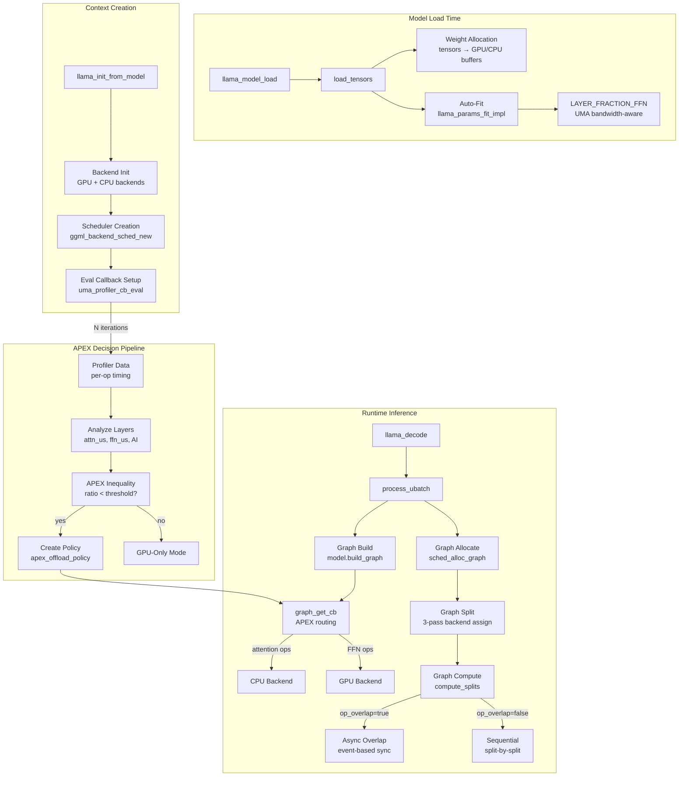
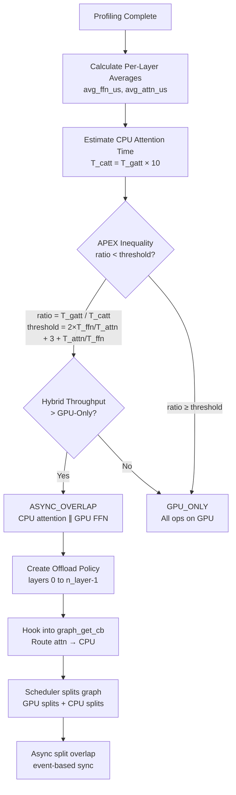
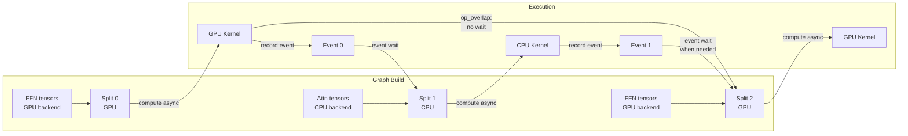
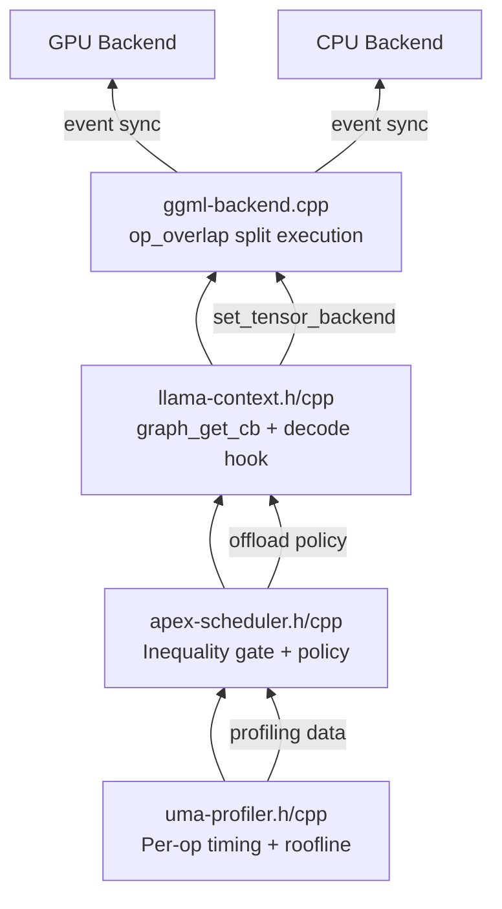
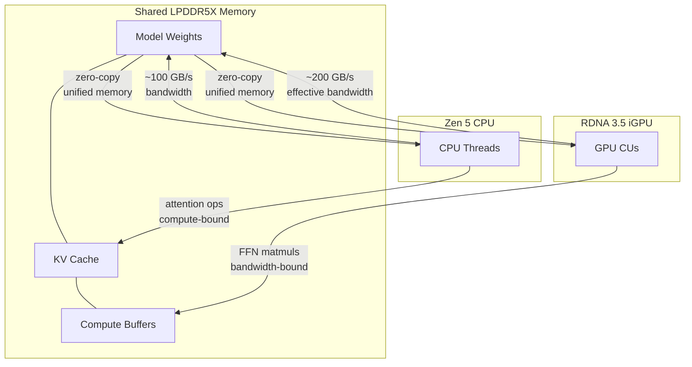

# APEX Runtime Scheduling — Architecture

## System Overview

## APEX Decision Flow

## Split Overlap Timing

```mermaid
gantt
    title Sequential vs Async Overlap Execution
    dateFormat X
    axisFormat %s

    section Sequential
    GPU FFN layer 0       :a1, 0, 10
    CPU Attn layer 0      :a2, 10, 18
    GPU FFN layer 1       :a3, 18, 28
    CPU Attn layer 1      :a4, 28, 36

    section Async Overlap
    GPU FFN layer 0       :b1, 0, 10
    CPU Attn layer 0      :b2, 5, 13
    GPU FFN layer 1       :b3, 10, 20
    CPU Attn layer 1      :b4, 15, 23
```

## Data Flow Through Scheduler

## Component Dependency

## UMA Memory Architecture (Strix Halo)

