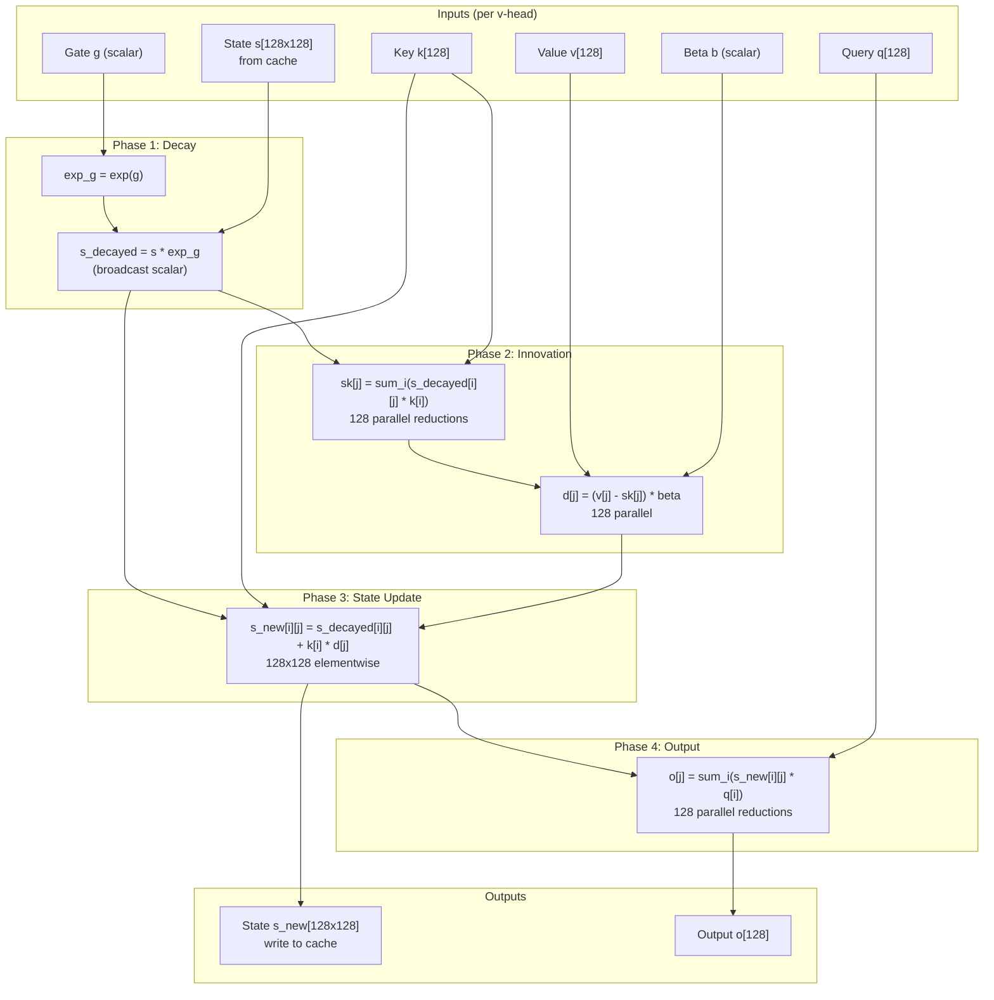
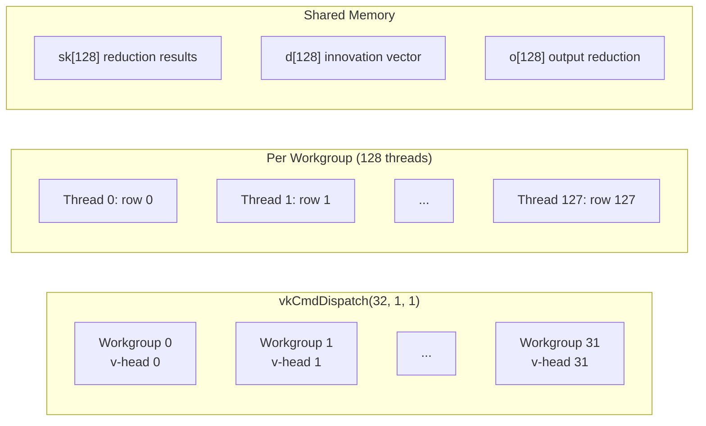
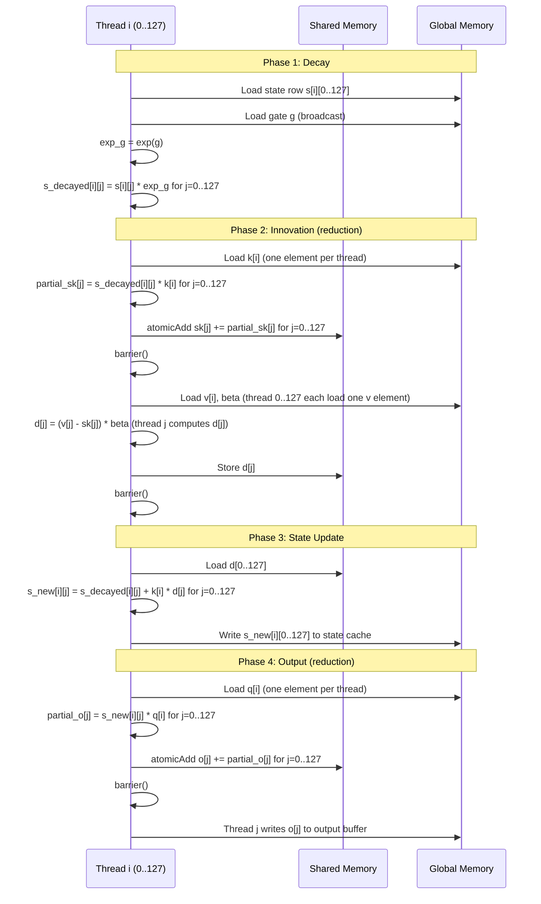

# Fused SSM Recurrence Kernel — Specification

## Overview

Fuse the Delta-Net SSM autoregressive recurrence (22 ops per layer) into a single
Vulkan compute dispatch per layer. This eliminates ~300 dispatches per token (~1,500 us)
from the 60 SSM layers in Qwen3.5-35B-A3B.

## Model Parameters (Qwen3.5-35B-A3B)

```
n_layer          = 40 (30 SSM + 10 attention, every 4th is attention)
ssm_d_inner      = 4096
ssm_d_state      = 128  (S_k = S_v = 128)
ssm_dt_rank      = 32   (H_v = num_v_heads = 32)
ssm_n_group      = 16   (H_k = num_k_heads = 16)
head_v_dim       = 4096 / 32 = 128
head_k_dim       = 128
GQA ratio        = H_v / H_k = 32 / 16 = 2 (2 v-heads share 1 k-head)
State per head   = S_v x S_v = 128 x 128 = 16,384 floats = 64 KB
State total      = 128 x 128 x 32 = 524,288 floats = 2 MB per sequence
```

## Mathematical Operations

The fused kernel computes (per v-head, per layer, per token):

```
Input:  s[128][128]  (state matrix from cache)
        q[128]       (query vector, shared with k-head group)
        k[128]       (key vector, shared with k-head group)
        v[128]       (value vector, per v-head)
        g            (gate scalar, per v-head — GDA variant)
        beta         (beta scalar, per v-head)

Phase 1 — Decay:
  s_decayed[i][j] = s[i][j] * exp(g)          // elementwise, broadcast g

Phase 2 — Innovation (dot product + subtract):
  sk[j] = sum_i(s_decayed[i][j] * k[i])       // reduce dim 0 for each j
  d[j]  = (v[j] - sk[j]) * beta               // innovation, gated

Phase 3 — Outer product state update:
  s_new[i][j] = s_decayed[i][j] + k[i] * d[j] // rank-1 update

Phase 4 — Output (dot product):
  o[j] = sum_i(s_new[i][j] * q[i])            // reduce dim 0 for each j

Output: s_new[128][128]  (write back to state cache)
        o[128]           (output vector)
```

## Architecture Diagram



## Dispatch Strategy



- **1 workgroup per v-head** = 32 workgroups per dispatch
- **128 threads per workgroup** = 1 thread per state row (S_v = 128)
- **Shared memory**: ~1.5 KB per workgroup (sk[128] + d[128] + o[128] floats)
- **Registers per thread**: 128 floats for state row + ~10 temporaries = ~552 bytes
- **GQA mapping**: `k_head_idx = v_head_idx / 2` (2 v-heads share 1 k-head)

## Execution Timeline (per workgroup)



## Reduction Strategy

The reductions (Phase 2 sk, Phase 4 o) sum across 128 rows for each of 128 columns.
Each thread owns one row and contributes to all 128 column sums.

**Option A: Atomic shared memory adds** (simpler, good for RDNA 3.5)
- Each thread does `atomicAdd(sk[j], s_decayed[i][j] * k[i])` for j=0..127
- 128 threads x 128 columns = 16,384 atomic adds
- RDNA 3.5 has fast shared memory atomics (native f32 atomicAdd in LDS)

**Option B: Transpose + subgroup reduction** (less contention)
- Transpose the problem: each thread accumulates across rows for its assigned columns
- Use subgroupAdd for partial sums within subgroups
- Requires multiple passes if 128 > subgroup_size

**Recommendation**: Start with Option A (atomic adds). Profile. Switch to Option B if
contention is a bottleneck. On RDNA 3.5 with 128 threads and 64-wide subgroups,
atomic contention should be manageable.

## Gherkin Specification

```gherkin
Feature: Fused SSM Recurrence Kernel
  The kernel fuses the Delta-Net autoregressive recurrence into a single Vulkan dispatch.

  Background:
    Given S_v = S_k = 128 (state dimension)
    And H_v = 32 (v-head count)
    And H_k = 16 (k-head count, GQA ratio = 2)
    And the model has 30 SSM layers out of 40 total

  Scenario: Single token generation produces correct output
    Given a state matrix s[128][128] with known values for each v-head
    And query q[128], key k[128], value v[128], gate g, beta b
    When the fused SSM recurrence kernel executes
    Then the output o[128] matches the unfused reference within 1e-4 relative error
    And the updated state s_new[128][128] matches the unfused reference within 1e-4

  Scenario: Gate decay is applied correctly
    Given a state matrix s[128][128] = all ones
    And gate g = ln(0.5) (so exp(g) = 0.5)
    When Phase 1 (decay) completes
    Then s_decayed[i][j] = 0.5 for all i,j

  Scenario: Innovation computation is correct
    Given s_decayed[128][128] = identity matrix
    And k[128] = [1, 0, 0, ..., 0] (unit vector)
    And v[128] = [3, 3, 3, ..., 3]
    And beta = 1.0
    When Phase 2 (innovation) completes
    Then sk[0] = 1.0, sk[1..127] = 0.0
    And d[0] = 3.0 - 1.0 = 2.0
    And d[1..127] = 3.0 - 0.0 = 3.0

  Scenario: Outer product state update is correct
    Given s_decayed[128][128] = zeros
    And k = [1, 2, 0, ..., 0]
    And d = [3, 4, 0, ..., 0]
    When Phase 3 (outer product update) completes
    Then s_new[0][0] = 1*3 = 3
    And s_new[0][1] = 1*4 = 4
    And s_new[1][0] = 2*3 = 6
    And s_new[1][1] = 2*4 = 8
    And all other s_new entries = 0

  Scenario: GQA head mapping works correctly
    Given H_v = 32, H_k = 16
    When workgroup for v-head 0 loads key
    Then it reads from k-head 0
    When workgroup for v-head 1 loads key
    Then it reads from k-head 0 (same k-head, GQA ratio = 2)
    When workgroup for v-head 2 loads key
    Then it reads from k-head 1

  Scenario: Multiple sequences are handled independently
    Given n_seqs = 2 with different state matrices
    When the kernel executes
    Then each sequence's state is updated independently
    And there is no cross-contamination between sequences

  Scenario: Numerical stability with extreme gate values
    Given gate g = -20.0 (exp(g) ~ 2e-9, near-zero decay)
    When the kernel executes
    Then the state decays to near-zero without NaN or Inf
    And the innovation d = v * beta (since sk ~ 0)

  Scenario: Numerical stability with large state values
    Given state matrix with values up to 1e6
    And the reduction sums 128 such values
    When Phase 2 reduction completes
    Then no overflow occurs (max sum ~ 128 * 1e6 = 1.28e8, within f32 range)

  Scenario: In-place state aliasing is safe
    Given state_in and state_out point to the same buffer
    When the kernel executes
    Then all reads from state_in complete before any writes to state_out
    Because Phase 1-2 reads complete before Phase 3 writes, separated by barrier()

  Scenario: Kernel integrates with existing fusion detection
    Given the Vulkan backend graph optimizer
    When it encounters the 22-op SSM recurrence pattern in the compute graph
    Then it sets fused_ssm_mode and num_additional_fused_ops
    And the fused dispatch replaces all 22 individual dispatches
    And the write_mask marks only the final state output and output vector

  Scenario: Fallback when fusion pattern doesn't match
    Given a model variant with different SSM structure (e.g., KDA instead of GDA)
    When the graph optimizer checks for the fusion pattern
    Then it falls back to individual op dispatches
    And correctness is preserved
```

## Files to Modify

1. **`ggml/src/ggml-vulkan/vulkan-shaders/ssm_recurrence.comp`** (NEW)
   - The fused GLSL compute shader

2. **`ggml/src/ggml-vulkan/vulkan-shaders/vulkan-shaders-gen.cpp`**
   - Register `ssm_recurrence.comp` for SPIR-V compilation

3. **`ggml/src/ggml-vulkan/ggml-vulkan.cpp`**
   - Add pipeline creation for `pipeline_ssm_recurrence_f32`
   - Add push constants struct `vk_op_ssm_recurrence_push_constants`
   - Add fusion detection pattern in graph optimizer (~line 14189)
   - Add dispatch function `ggml_vk_ssm_recurrence()`
   - Add case in compute phase to call fused kernel

## Performance Targets

| Metric | Current (unfused) | Target (fused) | Improvement |
|--------|-------------------|----------------|-------------|
| Dispatches per token | ~330 SSM ops (11/layer x 30) | 30 (1 per layer) | 11x fewer |
| SSM overhead per token | ~1,800 us | ~200-300 us | 6-9x faster |
| Total tok/s (tg64) | 58.5 | ~63-65 | +8-11% |

## Risks and Mitigations

| Risk | Impact | Mitigation |
|------|--------|------------|
| Atomic contention in reduction | Slower than expected | Switch to transpose + subgroup reduction |
| Register pressure (128 floats/thread) | Low occupancy | Split into 2 passes of 64 columns each |
| GDA vs KDA gate variants | Wrong fusion | Detect variant in graph optimizer, only fuse GDA initially |
| Float rounding differences | Slightly different outputs | Accept 1e-4 relative error, verify with backend-ops tests |
| State aliasing (in == out buffer) | Corruption | Barrier between read phases and write phase |
