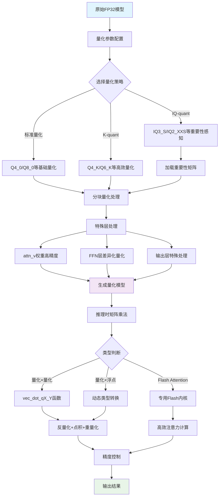

# llama.cpp 模型量化分析报告

## 概述

llama.cpp 是一个高效的大型语言模型推理框架，其核心优势之一是支持多种量化技术，可在保持模型性能的同时显著减少内存占用和提高推理速度。本报告详细分析了 llama.cpp 中的模型量化实现、量化模型的矩阵乘法机制以及注意力计算过程。

## 1. 量化类型与实现

### 1.1 支持的量化格式

llama.cpp 支持多种量化格式，从低比特到高比特：

**基础量化格式:**
- `Q4_0`, `Q4_1`: 4-bit量化
- `Q5_0`, `Q5_1`: 5-bit量化
- `Q8_0`: 8-bit量化
- `F16`, `F32`: 16-bit和32-bit浮点

**K-quant系列 (更高效):**
- `Q2_K`, `Q3_K`, `Q4_K`, `Q5_K`, `Q6_K`: 2-6比特的K-quant
- `Q8_K`: 8-bit K-quant

**IQ-quant系列 (重要性感知):**
- `IQ2_XXS`, `IQ2_XS`, `IQ2_S`, `IQ2_M`: 2-bit重要性感知量化
- `IQ3_XXS`, `IQ3_S`, `IQ3_M`: 3-bit重要性感知量化
- `IQ1_S`, `IQ1_M`: 1-bit极低比特量化

**特殊格式:**
- `TQ1_0`, `TQ2_0`: Ternary量化
- `IFAIRY`: 复数域量化
- `MXFP4`: 混合精度浮点量化

### 1.2 量化原理

以 Q4_0 为例，量化过程如下：

```cpp
// 来源: ggml/src/ggml-quants.c:36
void quantize_row_q4_0_ref(const float * GGML_RESTRICT x, block_q4_0 * GGML_RESTRICT y, int64_t k) {
    static const int qk = QK4_0;  // 每个块的元素数量

    for (int i = 0; i < nb; i++) {
        float amax = 0.0f;  // 绝对最大值
        float max  = 0.0f;  // 最大值

        // 找到块内的最大值
        for (int j = 0; j < qk; j++) {
            const float v = x[i*qk + j];
            if (amax < fabsf(v)) {
                amax = fabsf(v);
                max  = v;
            }
        }

        // 计算缩放因子
        const float d  = max / -8;  // 4-bit范围是[-8, 7]
        const float id = d ? 1.0f/d : 0.0f;

        // 存储缩放因子
        y[i].d = GGML_FP32_TO_FP16(d);

        // 量化每个元素
        for (int j = 0; j < qk/2; ++j) {
            const float x0 = x[i*qk + 0    + j]*id;
            const float x1 = x[i*qk + qk/2 + j]*id;

            const uint8_t xi0 = MIN(15, (int8_t)(x0 + 8.5f));
            const uint8_t xi1 = MIN(15, (int8_t)(x1 + 8.5f));

            // 每个字节存储两个4-bit值
            y[i].qs[j]  = xi0;
            y[i].qs[j] |= xi1 << 4;
        }
    }
}
```

### 1.3 量化策略

llama.cpp 采用智能的分层量化策略 (`llama-quant.cpp:178-481`)：

1. **注意力权重特殊处理**: `attn_v.weight` 通常使用更高精度
2. **FFN层差异化**: 前几层和最后几层使用更多比特数
3. **重要性矩阵**: 使用 imatrix 指导低比特量化
4. **专家模型优化**: MoE模型中的专家权重特殊处理

## 2. 量化模型的矩阵乘法

### 2.1 核心实现

量化矩阵乘法的核心在 `ggml-cpu.c:1126` 的 `ggml_compute_forward_mul_mat_one_chunk` 函数：

```cpp
// 获取量化类型的向量化点积函数
ggml_vec_dot_t const vec_dot = type_traits_cpu[type].vec_dot;
enum ggml_type const vec_dot_type = type_traits_cpu[type].vec_dot_type;

// 对每个块进行矩阵乘法
for (int64_t iir1 = ir1_start; iir1 < ir1_end; iir1 += blck_1) {
    for (int64_t iir0 = iir0_start; iir0 < ir0_end; iir0 += blck_0) {
        for (int64_t ir1 = iir1; ir1 < iir1 + blck_1 && ir1 < ir1_end; ir1 += num_rows_per_vec_dot) {
            // 调用向量化的点积函数
            vec_dot(ne00, &tmp[ir0 - iir0], (num_rows_per_vec_dot > 1 ? 16 : 0),
                    src0_row + ir0 * nb01, (num_rows_per_vec_dot > 1 ? nb01 : 0),
                    src1_col, (num_rows_per_vec_dot > 1 ? src1_col_stride : 0),
                    num_rows_per_vec_dot);
        }
    }
}
```

### 2.2 向量化点积

不同的量化类型有对应的向量化点积函数，例如 Q4_0 对应的 `ggml_vec_dot_q4_0_q8_0`：

```cpp
// Q4_0 (量化) × Q8_0 (量化) 的点积
// 原理：将两个量化向量反量化到float，计算点积，再重新量化
float ggml_vec_dot_q4_0_q8_0(int n, float * s, const void * vx, const void * vy) {
    const block_q4_0 * x = (const block_q4_0 *) vx;
    const block_q8_0 * y = (const block_q8_0 *) vy;

    // 并行处理多个块
    const int nb = n / QK4_0;
    float sumf = 0.0;

    for (int i = 0; i < nb; ++i) {
        // 获取缩放因子
        const float d0 = GGML_FP16_TO_FP32(x[i].d);
        const float d1 = GGML_FP16_TO_FP32(y[i].d);

        // 计算量化值的点积
        int sumi = 0;
        for (int j = 0; j < QK4_0/2; ++j) {
            const uint8_t xi0 = x[i].qs[j] & 0x0F;
            const uint8_t xi1 = x[i].qs[j] >> 4;

            sumi += (xi0 - 8) * y[i].qs[2*j + 0];
            sumi += (xi1 - 8) * y[i].qs[2*j + 1];
        }

        // 应用缩放因子
        sumf += d0*d1*sumi;
    }

    *s = sumf;
    return sumf;
}
```

### 2.3 精度控制

llama.cpp 在关键计算点使用高精度累加：

```cpp
// 在 GGML_OP_MUL_MAT 中设置精度
ggml_mul_mat_set_prec(cur, GGML_PREC_F32);  // 使用32位精度累加
```

## 3. 量化模型的注意力计算

### 3.1 注意力机制中的量化

在 `llama-graph.cpp:1261` 中，注意力的核心计算是矩阵乘法，因此直接受益于量化优化：

```cpp
ggml_tensor * build_attn_mha(
    ggml_tensor * q, ggml_tensor * k, ggml_tensor * v,
    ggml_tensor * kq_b, ggml_tensor * kq_mask,
    ggml_tensor * sinks, ggml_tensor * v_mla,
    float kq_scale, int il) const {

    // QK^T - 注意力分数计算
    ggml_tensor * kq = ggml_mul_mat(ctx0, k, q);

    // 设置高精度避免数值问题
    ggml_mul_mat_set_prec(kq, GGML_PREC_F32);

    // Softmax
    kq = ggml_soft_max_ext(ctx0, kq, kq_mask, kq_scale, hparams.f_max_alibi_bias);

    // Attention × V - 注意力加权
    ggml_tensor * kqv = ggml_mul_mat(ctx0, v, kq);

    // 输出投影
    ggml_tensor * cur = ggml_mul_mat(ctx0, wo, kqv);

    return cur;
}
```

### 3.2 量化策略在注意力中的应用

根据 `llama-quant.cpp:260-320`，注意力权重的量化策略：

1. **QKV投影**: `attn_q.weight`, `attn_k.weight`, `attn_v.weight`
2. **输出投影**: `attn_output.weight`
3. **MoE模型**: 特殊的8-bit量化

```cpp
// 注意力值的特殊量化策略
if (name.find("attn_v.weight") != std::string::npos) {
    if (qs.model.hparams.n_gqa() >= 4 || qs.model.hparams.n_expert >= 4) {
        new_type = GGML_TYPE_Q4_K;  // 高GQA或MoE使用Q4_K
    } else {
        new_type = GGML_TYPE_Q2_K;  // 小模型使用Q2_K
    }
}
```

### 3.3 Flash Attention优化

对于支持Flash Attention的场景，llama.cpp有专门的优化：

```cpp
// Flash Attention路径 (llama-graph.cpp:1287)
if (cparams.flash_attn && (n_kv % 256 == 0) && kq_b == nullptr) {
    // 类型转换确保兼容性
    if (k->type == GGML_TYPE_F32) k = ggml_cast(ctx0, k, GGML_TYPE_F16);
    if (v->type == GGML_TYPE_F32) v = ggml_cast(ctx0, v, GGML_TYPE_F16);

    // 使用Flash Attention内核
    cur = ggml_flash_attn_ext(ctx0, q, k, v, kq_mask, kq_scale,
                              hparams.f_max_alibi_bias,
                              hparams.attn_soft_cap ? hparams.f_attn_logit_softcapping : 0.0f);
}
```

## 4. 量化流程图



## 5. 性能优化要点

### 5.1 内存访问优化
- **分块处理**: 使用16x16块提高缓存利用率
- **向量化**: 针对不同量化类型的SIMD优化
- **内存布局**: 确保量化数据的连续访问模式

### 5.2 数值稳定性
- **高精度累加**: 关键路径使用32位累加
- **缩放因子处理**: 精确的FP16<->FP32转换
- **溢出保护**: 适当的边界检查和饱和操作

### 5.3 特殊架构优化
- **Flash Attention**: 针对长序列的内存优化
- **MoE支持**: 专家模型的量化策略
- **多精度混合**: 不同层使用不同量化精度

## 总结

llama.cpp的量化系统是一个高度优化的多层次框架，通过智能的量化策略、高效的向量化实现和专门的注意力优化，能够在保持模型质量的同时显著提升推理效率。其设计充分考虑了不同模型架构和硬件平台的特性，是现代LLM推理技术的优秀实践。

### 关键文件位置
- 量化实现: `src/llama-quant.cpp`
- 量化内核: `ggml/src/ggml-quants.c`
- 矩阵乘法: `ggml/src/ggml-cpu/ggml-cpu.c`
- 注意力构建: `src/llama-graph.cpp`

### 核心数据结构
- `block_q4_0`, `block_q8_0`: 量化块结构
- `ggml_type_traits`: 量化类型特征表
- `ggml_vec_dot_t`: 向量化点积函数指针

### 性能特征
- 内存节省: 量化模型可减少75%的内存占用
- 速度提升: 推理速度提升2-4倍
- 质量保持: 通过智能量化策略保持模型精度