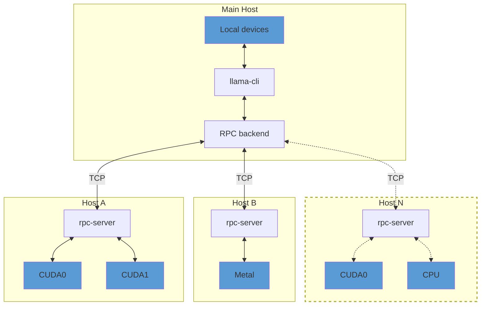

## Overview

> [!IMPORTANT]
> This example and the RPC backend are currently in a proof-of-concept development stage. As such, the functionality is fragile and
> insecure. **Never run the RPC server on an open network or in a sensitive environment!**

The `rpc-server` allows exposing `ggml` devices on a remote host.
The RPC backend communicates with one or several instances of `rpc-server` and offloads computations to them.
This can be used for distributed LLM inference with `llama.cpp` in the following way:



By default, `rpc-server` exposes all available accelerator devices on the host.
If there are no accelerators, it exposes a single `CPU` device.

## Usage

### Remote hosts

On each remote host, build the backends for each accelerator by adding `-DGGML_RPC=ON` to the build options.
For example, to build the `rpc-server` with support for CUDA accelerators:

```bash
mkdir build-rpc-cuda
cd build-rpc-cuda
cmake .. -DGGML_CUDA=ON -DGGML_RPC=ON
cmake --build . --config Release
```

When started, the `rpc-server` will detect and expose all available `CUDA` devices:

```bash
$ bin/rpc-server
ggml_cuda_init: GGML_CUDA_FORCE_MMQ:    no
ggml_cuda_init: GGML_CUDA_FORCE_CUBLAS: no
ggml_cuda_init: found 1 CUDA devices:
  Device 0: NVIDIA GeForce RTX 5090, compute capability 12.0, VMM: yes
Starting RPC server v3.0.0
  endpoint       : 127.0.0.1:50052
  local cache    : n/a
Devices:
  CUDA0: NVIDIA GeForce RTX 5090 (32109 MiB, 31588 MiB free)
```

You can control the set of exposed CUDA devices with the `CUDA_VISIBLE_DEVICES` environment variable or the `--device` command line option. The following two commands have the same effect:
```bash
$ CUDA_VISIBLE_DEVICES=0 bin/rpc-server -p 50052
$ bin/rpc-server --device CUDA0 -p 50052
```

### Main host

On the main host build `llama.cpp` with the backends for the local devices and add `-DGGML_RPC=ON` to the build options.
Finally, when running `llama-cli` or `llama-server`, use the `--rpc` option to specify the host and port of each `rpc-server`:

```bash
$ llama-cli -hf ggml-org/gemma-3-1b-it-GGUF -ngl 99 --rpc 192.168.88.10:50052,192.168.88.11:50052
```

By default, llama.cpp distributes model weights and the KV cache across all available devices -- both local and remote -- in proportion to each device's available memory.
You can override this behavior with the `--tensor-split` option and set custom proportions when splitting tensor data across devices.

### Local cache

The RPC server can use a local cache to store large tensors and avoid transferring them over the network.
This can speed up model loading significantly, especially when using large models.
To enable the cache, use the `-c` option:

```bash
$ bin/rpc-server -c
```

By default, the cache is stored in the `$HOME/.cache/llama.cpp/rpc` directory and can be controlled via the `LLAMA_CACHE` environment variable.

### RDMA transport

On Linux systems with RoCEv2-capable NICs (e.g. Mellanox ConnectX), the RPC backend can use RDMA instead of TCP for lower latency and higher throughput. The transport is negotiated automatically -- no changes to command-line usage are required.

RDMA is enabled by default when `libibverbs` is found at build time.

### TCP buffer tuning

For high-latency or overlay-network links, you can request larger TCP send and
receive buffers on both the RPC client and server:

```bash
export GGML_RPC_TCP_BUFFER_SIZE=4194304
```

The value is in bytes and is applied to accepted client sockets and outbound RPC
connections. Leave it unset to use the operating-system defaults. Larger buffers
can improve bulk model/tensor transfer on some networks, but they should be
benchmarked with your model, split, and network because they do not remove
per-token synchronization costs.

### Cache threshold tuning

When `rpc-server` is started with `-c`, tensors larger than 10 MiB are probed by
hash before upload and saved in the server cache. This avoids resending large
unchanged tensors, but small-model or many-small-tensor workloads can still spend
most wall-clock time uploading weights on every fresh client run. For repeated
experiments on trusted machines, `GGML_RPC_CACHE_MIN_SIZE` can lower the client
probe threshold:

```bash
export GGML_RPC_CACHE_MIN_SIZE=1048576
./build/bin/llama-bench --rpc 192.0.2.10:50052 ...
```

You may also set the same variable on selected `rpc-server` processes when you
want those servers to save smaller tensors. Lower server thresholds can create
many more cache files and increase hashing and disk churn, so change them per
node only after measuring that node. Leaving the server unset keeps the default
10 MiB save threshold while still allowing an experimental client to probe
smaller tensors; cache misses simply fall back to uploading the tensor. Lower
values trade less transfer after the cache is warm for more hashing, cache files,
and small hash-probe RPCs, so keep the default unless real network measurements
show a wall-clock win. Setting the threshold to `0` is the most aggressive option
and can hurt per-token throughput on workloads with many tiny tensors.

### Benchmarking changes

The `tools/rpc/bench_rpc_compare.py` helper can compare two local build trees
with the same model and RPC settings:

```bash
python3 tools/rpc/bench_rpc_compare.py \
  --base-bin /path/to/base/build/bin \
  --patch-bin /path/to/patch/build/bin \
  --model /path/to/model.gguf \
  --host 127.0.0.1 \
  --server-device CUDA0 \
  --device RPC0
```

This helper starts both RPC servers locally. Use it to isolate protocol overhead
before drawing deployment conclusions, then repeat the same `llama-bench`
parameters against manually started remote `rpc-server` processes on the real
network. Loopback runs do not model overlay routing, retransmits, slow remote
disks, or accelerator imbalance.

For Tailscale or LAN runs where the base and patch `rpc-server` processes are
already running on remote hosts, use `tools/rpc/bench_rpc_remote.py` from the
main host. It runs the local `llama-bench` client against both endpoints and
writes each JSONL stream plus a `summary.json` with the command, selected
environment, endpoint hosts and ports, model, prompt, generation, repetition,
`-ngl`, device, elapsed wall-clock time, and prompt/decode tokens/sec averages,
medians, and standard deviations:

```bash
python3 tools/rpc/bench_rpc_remote.py \
  --base-llama-bench /path/to/base/build/bin/llama-bench \
  --patch-llama-bench /path/to/patch/build/bin/llama-bench \
  --model /path/to/model.gguf \
  --base-rpc 100.64.0.10:50052 \
  --patch-rpc 100.64.0.11:50052 \
  --prompt 512 \
  --gen 128 \
  --repetitions 7 \
  --ngl 99 \
  --device RPC0 \
  --patch-env GGML_RPC_CACHE_MIN_SIZE=1048576
```

Use `--env KEY=VALUE` for settings that should apply to both cases and
`--base-env` or `--patch-env` for one-sided experiments. The summary records the
effective environment for each case, with sensitive-looking values redacted.

The remote helper only connects to endpoints passed with `--base-rpc` and
`--patch-rpc`; it does not SSH to hosts or start/stop servers. Use `--dry-run`
to write the planned commands without connecting. Use `--env KEY=VALUE` to set
and record client environment variables that apply to both cases, such as
`GGML_RPC_TCP_BUFFER_SIZE`; use `--base-env` or `--patch-env` for one-sided
knobs such as `GGML_RPC_CACHE_MIN_SIZE`. Use `--llama-bench` when both cases
should use the same local client binary, or `--base-llama-bench` and
`--patch-llama-bench` when you want an end-to-end base-client/base-server versus
patch-client/patch-server comparison. For warmed-cache or one-sided experiments,
use `--only base` or `--only patch` with the matching endpoint and binary.

When benchmarking CUDA RPC servers across different GPU generations, build for
the remote GPUs as well as the local client GPU. For example, an RTX 3070 server
and RTX 4060 client need both architectures:

```bash
cmake -B build-cuda -DGGML_CUDA=ON -DGGML_RPC=ON \
  -DCMAKE_CUDA_ARCHITECTURES="86-real;89-real"
```

If the server log reports `no kernel image is available for execution on the
device`, rebuild with the missing remote architecture before comparing RPC
throughput.

### RPC tracing

Set `GGML_RPC_TRACE=1` on the RPC client to print a summary of RPC command
counts, input bytes, output bytes, one-way send time, and request/response wait
time when the RPC backend is freed:

```bash
GGML_RPC_TRACE=1 ./build/bin/llama-bench --rpc 192.0.2.10:50052 ...
```

The client summary also reports cross-endpoint tensor-copy fallbacks, which are
copies that cannot use the same-server `COPY_TENSOR` RPC path and must fall back
through the main host. Setting `GGML_RPC_TRACE=1` on `rpc-server` prints
per-connection server command counts and handler times to that server's stderr.
One-way commands such as `SET_TENSOR` and `GRAPH_RECOMPUTE` only show local send
time in the client table; use server tracing to measure remote handler time.
Tracing is disabled by default and should be used for diagnostics because it
adds timing and logging overhead.

### Troubleshooting

Use the `GGML_RPC_DEBUG` environment variable to enable debug messages from `rpc-server`:
```bash
$ GGML_RPC_DEBUG=1 bin/rpc-server
```
